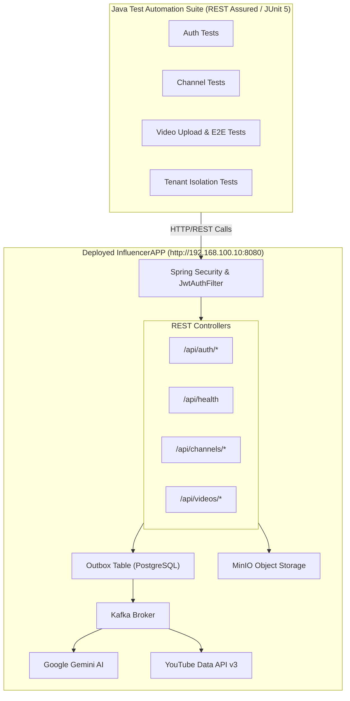
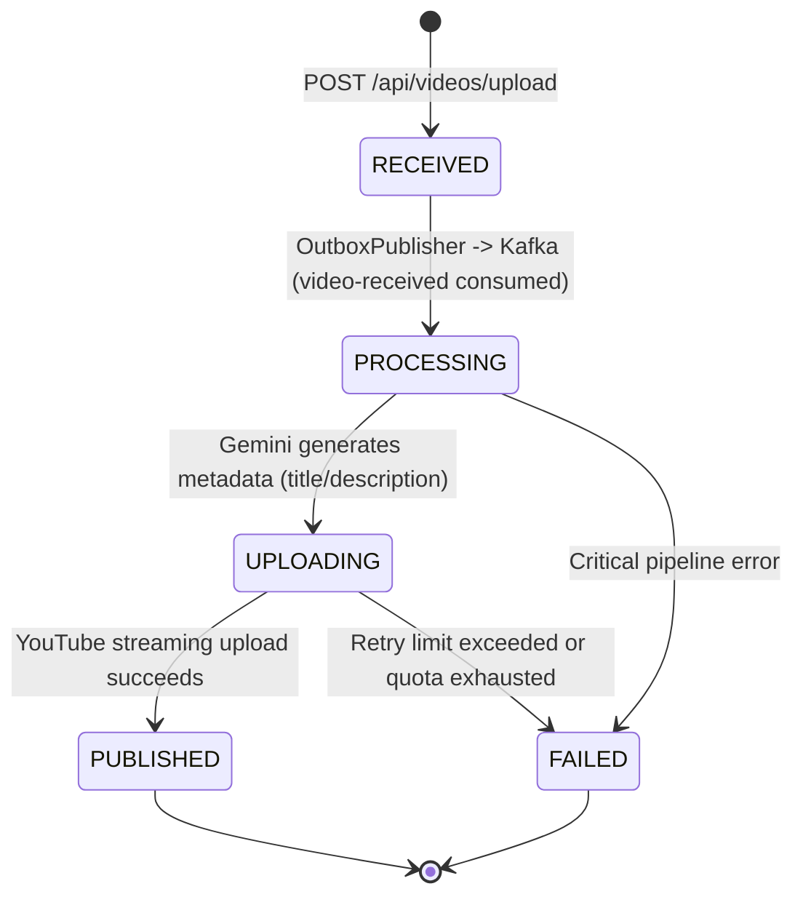
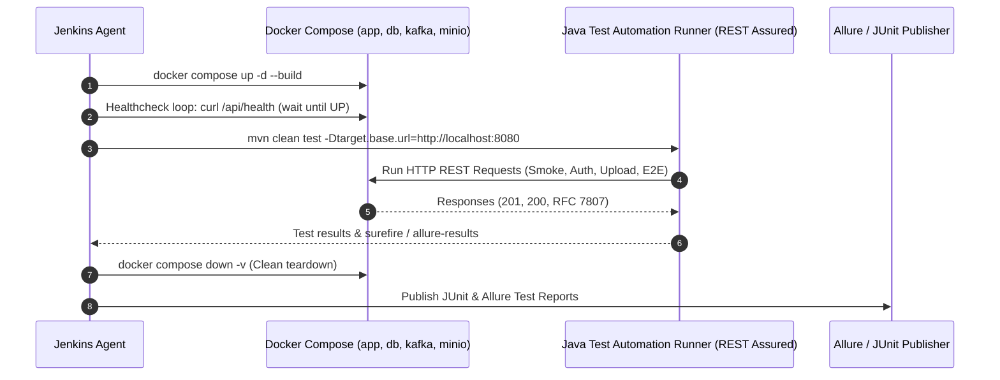

# Automated API Test Plan — InfluencerAPP Deployed Services

**Target Environment Base URL:** `http://192.168.100.10:8080`  
**Application Under Test (AUT):** InfluencerAPP (Spring Boot 3.3.4, Hexagonal Architecture, Multi-Tenant REST API)  
**Execution Vehicle:** Standalone Java Automated Testing Suite (REST Assured + JUnit 5 + Allure)  
**Status:** Approved Specification / Ready for Implementation  
**Version:** 1.0.0  

---

## 1. Executive Summary & Objectives

The purpose of this Test Plan is to define the testing strategy, test architecture, test scenario matrix, data management approach, and execution protocol for automated black-box and grey-box API testing of the **InfluencerAPP** services deployed at `http://192.168.100.10:8080`.

### Key Objectives:
1. **Functional Correctness:** Verify all REST endpoints satisfy business logic requirements, including multi-tenant isolation, idempotency, streaming video uploads, and async publishing state transitions.
2. **Contract & Schema Compliance:** Ensure all request/response payloads comply strictly with the OpenAPI 3.0 specification (`docs/specs/arq/openapi.yaml`) and error responses adhere to RFC 7807 (`application/problem+json`).
3. **Security & Access Control:** Confirm JWT Bearer authentication, tenant isolation across tenants, and rejection of unauthorized or malformed tokens.
4. **Resilience & Idempotency:** Validate that duplicate uploads using the `Idempotency-Key` header do not duplicate work or create duplicate records.
5. **Blueprint for Java Test Suite:** Provide a clear architecture and class design for the Java-based test automation runner application.

---

## 2. System Under Test (SUT) Architecture & Scope

### 2.1 Service Topology


### 2.2 Endpoints in Scope

| Method | Endpoint | Auth Required | Description |
|:-------|:---------|:--------------|:------------|
| `GET` | `/api/health` | No | System health check (PostgreSQL, Kafka, MinIO, YouTube API) |
| `POST` | `/api/auth/register` | No | New user and tenant registration |
| `POST` | `/api/auth/login` | No | Authentication; yields JWT Bearer token and `tenantId` |
| `POST` | `/api/channels/register` | Yes (`Bearer <JWT>`) | Link YouTube channel via OAuth2 token exchange |
| `GET` | `/api/channels` | Yes (`Bearer <JWT>`) | Paginated listing of linked channels for authenticated tenant |
| `POST` | `/api/videos/upload` | Yes (`Bearer <JWT>`) | Multipart video upload (`file`, `channelId`, `Idempotency-Key`) |
| `GET` | `/api/videos/{videoId}` | Yes (`Bearer <JWT>`) | Query video processing status and generated AI metadata |
| `GET` | `/api/videos` | Yes (`Bearer <JWT>`) | Paginated listing of videos for authenticated tenant |

---

## 3. Test Automation Technology Stack

The test automation engine will be developed as a standalone Java 17+ application with the following components:

| Role | Technology / Tool | Version | Justification |
|:-----|:------------------|:--------|:--------------|
| **Language** | Java | 17 LTS | Standard LTS, aligned with production codebase. |
| **HTTP Client & DSL** | REST Assured | 5.4.0+ | Fluent BDD-style syntax (`given()`, `when()`, `then()`), native JSON and multipart support. |
| **Test Runner & Engine** | JUnit 5 (Jupiter) | 5.10.x | Advanced parameterized tests, lifecycle management, tagging (`@Tag("smoke")`), parallel execution. |
| **Assertions** | AssertJ | 3.25.x | Rich, fluent assertions with descriptive failure messages. |
| **Schema Validation** | `json-schema-validator` | 5.4.0+ | Validates responses against JSON Schema derived from `openapi.yaml`. |
| **Async Polling** | Awaitility | 4.2.x | Polling video status during async transitions (`RECEIVED` -> `PROCESSING` -> `PUBLISHED`). |
| **Data Generation** | Java Faker / Datafaker | 2.2.x | Generates dynamic, collision-free test user emails and channel names. |
| **Reporting** | Allure Framework | 2.27.x | Interactive HTML reports with request/response logs, attachments, and failure categorization. |
| **Build & Execution** | Apache Maven | 3.9+ | Standard dependency management and test phase execution (`mvn clean test`). |

---

## 4. Test Suites & Test Scenario Matrix

### 4.1 Suite 1: System Health & Connectivity (Smoke Tests)
*Tag: `@Tag("smoke")`*

| Test ID | Scenario | Request Details | Expected Result |
|:--------|:---------|:----------------|:----------------|
| `SMK-001` | System Health Check | `GET /api/health` | HTTP `200 OK`, body contains `{"status": "UP"}`, subcomponents (`postgresql`, `kafka`, `minio`) status UP. |
| `SMK-002` | Correlation ID Header Tracing | `GET /api/health` with `X-Correlation-Id: <UUID>` | HTTP `200 OK`, response header `X-Correlation-Id` matches client UUID. |

---

### 4.2 Suite 2: Authentication & Authorization
*Tag: `@Tag("auth")`*

| Test ID | Scenario | Request Details | Expected Result |
|:--------|:---------|:----------------|:----------------|
| `AUTH-001` | Successful User Registration | `POST /api/auth/register`<br>`{"email": "valid_<uuid>@example.com", "password": "SecurePass123!"}` | HTTP `201 Created`, `Location` header contains `/api/auth/register`. |
| `AUTH-002` | Duplicate Registration Rejection | `POST /api/auth/register` with already registered email | HTTP `409 Conflict` (or `400 Bad Request`), RFC 7807 problem detail with `title: "Domain Error"`. |
| `AUTH-003` | Registration Validation - Invalid Email | `POST /api/auth/register`<br>`{"email": "not-an-email", "password": "SecurePass123!"}` | HTTP `400 Bad Request`, RFC 7807 with `fieldErrors.email`. |
| `AUTH-004` | Registration Validation - Short Password | `POST /api/auth/register`<br>`{"email": "user@example.com", "password": "123"}` | HTTP `400 Bad Request`, RFC 7807 with `fieldErrors.password = "Password must be at least 8 characters"`. |
| `AUTH-005` | Successful Login | `POST /api/auth/login`<br>`{"email": "<registered_email>", "password": "<password>"}` | HTTP `200 OK`, body contains non-null `accessToken`, `tenantId`, and `expiresIn == 3600`. |
| `AUTH-006` | Login with Bad Password | `POST /api/auth/login`<br>`{"email": "<registered_email>", "password": "WrongPassword!"}` | HTTP `400 Bad Request` or `401 Unauthorized` with RFC 7807 details. |
| `AUTH-007` | Login with Non-Existent User | `POST /api/auth/login`<br>`{"email": "ghost_<uuid>@example.com", "password": "SecurePass123!"}` | HTTP `400 Bad Request` or `401 Unauthorized`. |
| `AUTH-008` | JWT Claims Verification | Inspect decoded JWT payload from `AUTH-005` | Claims `sub`, `tenantId`, and `exp` are valid; signature verified with HMAC-SHA. |

---

### 4.3 Suite 3: Security & Multi-Tenancy Boundary Testing
*Tag: `@Tag("security")`*

| Test ID | Scenario | Request Details | Expected Result |
|:--------|:---------|:----------------|:----------------|
| `SEC-001` | Unauthorized Access to Protected Route | `GET /api/channels` without `Authorization` header | HTTP `401 Unauthorized`, RFC 7807 `application/problem+json` (`title: "Unauthorized"`). |
| `SEC-002` | Access with Malformed Bearer Token | `GET /api/videos` with `Authorization: Bearer invalid_jwt_string` | HTTP `401 Unauthorized`. |
| `SEC-003` | Cross-Tenant Video Access Isolation | **Tenant A** uploads Video 1.<br>**Tenant B** attempts `GET /api/videos/{video1_id}` with Tenant B's JWT token. | HTTP `404 Not Found` (or `401/403`). Tenant B must NEVER see Tenant A's video details. |
| `SEC-004` | Cross-Tenant Channel Listing Isolation | **Tenant A** registers Channel 1.<br>**Tenant B** calls `GET /api/channels` with Tenant B's JWT. | Channel 1 is NOT present in Tenant B's channel list. |

---

### 4.4 Suite 4: Channel Management
*Tag: `@Tag("channels")`*

| Test ID | Scenario | Request Details | Expected Result |
|:--------|:---------|:----------------|:----------------|
| `CHAN-001` | Register YouTube Channel | `POST /api/channels/register`<br>Auth: Valid JWT<br>`{"name": "Tech Reviews", "encryptedAccessToken": "tokenA", "encryptedRefreshToken": "tokenB", "tokenExpiry": "2026-12-31T23:59:59Z"}` | HTTP `201 Created`, `Location` header `/api/channels/register`. |
| `CHAN-002` | Register Channel Validation Failure | `POST /api/channels/register`<br>`{"name": "", "encryptedAccessToken": ""}` | HTTP `400 Bad Request`, RFC 7807 with validation details. |
| `CHAN-003` | List Tenant Channels (Default Pagination) | `GET /api/channels` with valid JWT | HTTP `200 OK`, `page == 0`, `size == 20`, `content` array includes registered channels. |
| `CHAN-004` | List Channels Custom Pagination | `GET /api/channels?page=0&size=5` | HTTP `200 OK`, `size == 5`, `totalPages` and `totalElements` populated correctly. |

---

### 4.5 Suite 5: Video Upload & Idempotency Pipeline
*Tag: `@Tag("videos")`*

| Test ID | Scenario | Request Details | Expected Result |
|:--------|:---------|:----------------|:----------------|
| `VID-001` | Successful Video Upload | `POST /api/videos/upload`<br>Auth: Valid JWT<br>Headers: `Idempotency-Key: <UUID>`<br>Multipart Form: `file` (sample.mp4, 5MB), `channelId: <Valid_Channel_UUID>` | HTTP `201 Created`, response body contains `{"videoId": "<UUID>"}`, `Location` header `/api/videos/<UUID>`. |
| `VID-002` | Upload Missing Idempotency Key | `POST /api/videos/upload` without `Idempotency-Key` header | HTTP `201 Created` or `400 Bad Request` (depending on whether header is optional or mandatory in target environment; verify behavior). |
| `VID-003` | Idempotent Retry (Exact Duplicate) | Send identical `POST /api/videos/upload` twice with the same `Idempotency-Key` and same payload within 24h | HTTP `201 Created` with identical `videoId`, or cached response returned; no duplicate video record created. |
| `VID-004` | Idempotency Key Conflict | Send second `POST /api/videos/upload` with SAME `Idempotency-Key` but DIFFERENT file/channelId | HTTP `409 Conflict`, RFC 7807 with `title: "Idempotency Conflict"`. |
| `VID-005` | Upload Disallowed File Type | `POST /api/videos/upload` with `file: malicious.exe` or `document.pdf` | HTTP `400 Bad Request` or `422 Unprocessable Entity` with validation detail. |
| `VID-006` | Upload File Size Exceeds Limit | `POST /api/videos/upload` with video file > 100MB | HTTP `413 Payload Too Large` or `400 Bad Request`, RFC 7807 Problem Detail. |
| `VID-007` | Upload with Non-Existent Channel | `POST /api/videos/upload` with random `channelId` UUID | HTTP `400 Bad Request` or `404 Not Found` with descriptive message. |

---

### 4.6 Suite 6: Asynchronous Processing & End-to-End Publishing Lifecycle
*Tag: `@Tag("e2e")`*



| Test ID | Scenario | Polling Logic & Verification Steps | Expected Result |
|:--------|:---------|:-----------------------------------|:----------------|
| `E2E-001` | Full Lifecycle: Upload to Publishing | 1. Register & Login User.<br>2. Register Channel.<br>3. Upload valid MP4 video.<br>4. Poll `GET /api/videos/{videoId}` using Awaitility every 3s up to 90s.<br>5. Track status transitions. | Status progresses: `RECEIVED` &rarr; `PROCESSING` &rarr; `UPLOADING` &rarr; `PUBLISHED`.<br>Title and description are populated.<br>`youtubeVideoId` and `youtubeUrl` are non-null. |
| `E2E-002` | Metadata Generation Fallback Verification | If Gemini circuit breaker opens or API fails: poll `GET /api/videos/{videoId}`. | Title and description are not null, populated with fallback template; video does not freeze in `PROCESSING`. |
| `E2E-003` | Paginated Video Listing | `GET /api/videos?page=0&size=10` | HTTP `200 OK`, `content` contains array of `VideoStatusResponse` objects matching tenant videos. |

---

### 4.7 Suite 7: Contract & RFC 7807 Error Response Compliance
*Tag: `@Tag("contract")`*

| Test ID | Scenario | Verification Focus |
|:--------|:---------|:-------------------|
| `CTR-001` | OpenAPI Schema Validation | Validate JSON responses against OpenAPI schemas (`RegisterResponse`, `LoginResponse`, `VideoStatusResponse`). |
| `CTR-002` | RFC 7807 Schema Validation | Validate all error responses (400, 401, 404, 409, 413, 500) against `ProblemDetail` schema (`type`, `title`, `status`, `detail`, `instance`). |

---

## 5. Java Test Automation Application Architecture

The Java test automation application will be built as a modular, maintainable Maven project using Page Object / API Client design patterns.

### 5.1 Project Package Structure
```
influencer-api-tests/
├── pom.xml
└── src/
    └── test/
        ├── java/
        │   └── com/influencerapp/test/
        │       ├── config/
        │       │   ├── TestConfig.java               # Reads base URL, credentials, timeouts
        │       │   └── BaseApiTest.java              # Sets up RestAssured, request/response logging
        │       ├── client/
        │       │   ├── AuthApiClient.java            # Wraps /api/auth/register, /api/auth/login
        │       │   ├── ChannelApiClient.java         # Wraps /api/channels/*
        │       │   ├── VideoApiClient.java           # Wraps /api/videos/upload, /api/videos/{id}
        │       │   └── HealthApiClient.java          # Wraps /api/health
        │       ├── model/
        │       │   ├── request/                      # RegisterRequest, LoginRequest, ChannelRequest
        │       │   ├── response/                     # LoginResponse, ChannelResponse, VideoResponse
        │       │   └── error/                        # ProblemDetailResponse
        │       ├── utils/
        │       │   ├── TestDataGenerator.java        # Unique emails, random UUIDs, fake tokens
        │       │   ├── MediaFileProvider.java        # Supplies dummy .mp4, large files, invalid types
        │       │   └── PollingUtils.java             # Awaitility polling helpers
        │       └── suites/
        │           ├── smoke/HealthSmokeTest.java
        │           ├── auth/AuthenticationTest.java
        │           ├── security/TenantIsolationTest.java
        │           ├── channel/ChannelManagementTest.java
        │           ├── video/VideoUploadTest.java
        │           └── e2e/VideoPublishingE2ETest.java
        └── resources/
            ├── application-test.properties           # target.base.url=http://192.168.100.10:8080
            ├── sample-files/
            │   ├── test-video-5mb.mp4
            │   └── invalid-file.txt
            └── schemas/
                ├── problem-detail-schema.json
                └── video-status-schema.json
```

### 5.2 Key Code Blueprint (REST Assured & Awaitility)

```java
// Example: BaseApiTest Setup
public abstract class BaseApiTest {
    protected static TestConfig config;

    @BeforeAll
    public static void globalSetup() {
        config = TestConfig.load();
        RestAssured.baseURI = config.getBaseUrl(); // http://192.168.100.10:8080
        RestAssured.filters(new AllureRestAssured(), new RequestLoggingFilter(), new ResponseLoggingFilter());
    }
}
```

```java
// Example: Async Video Lifecycle Polling using Awaitility
public VideoStatusResponse pollUntilPublished(String videoId, String jwtToken) {
    return Awaitility.await()
        .atMost(Duration.ofSeconds(90))
        .pollInterval(Duration.ofSeconds(3))
        .until(() -> videoApiClient.getVideoStatus(videoId, jwtToken),
               res -> res.getStatus().equals("PUBLISHED") || res.getStatus().equals("FAILED"));
}
```

---

## 6. Test Data Management & Teardown Strategy

1. **Unique Tenant Generation:**
   - Every test case generating a user will append a UUID suffix (`testuser_<uuid>@example.com`). This guarantees zero collision across test runs without requiring manual database resets.
2. **Media Assets:**
   - A lightweight sample MP4 video (~2MB to 5MB) will be committed to `src/test/resources/sample-files/` to ensure fast upload times during regression.
   - Oversized files (>100MB) will be generated dynamically on-the-fly via a sparse or temporary binary byte generator to avoid storing large binary files in the repository.
3. **OAuth2 Stubs:**
   - When real YouTube OAuth tokens are expired or unavailable in the test environment, tests will verify the channel registration schema and encryption pipeline with valid-format mock tokens.

---

## 7. Execution Strategy & CI/CD Integration

### 7.1 Maven Execution Profiles

```bash
# Execute only Smoke Tests against the remote deployed environment
mvn clean test -Dgroups="smoke" -Dtarget.base.url="http://192.168.100.10:8080"

# Execute complete Regression Suite
mvn clean test -Dgroups="regression" -Dtarget.base.url="http://192.168.100.10:8080"

# Execute End-to-End Publishing Pipeline Tests
mvn clean test -Dgroups="e2e" -Dtarget.base.url="http://192.168.100.10:8080"

# Generate Allure HTML Report
mvn allure:serve
```

### 7.2 Defect Severity & Pass/Fail Criteria
- **Pass Criteria:** 100% of Smoke Tests and 95%+ of Regression/E2E tests pass. Zero critical/high severity defects.
- **Critical Severity Defect:** Multi-tenancy leak (Tenant B accessing Tenant A's data), JWT authentication bypass, server 500 error on valid inputs.
- **High Severity Defect:** Duplicate upload when `Idempotency-Key` is provided, video upload failure for valid MP4 < 100MB, failure to emit RFC 7807 on client error.

---

## 8. CI/CD Pipeline Integration & Ephemeral Environments (Jenkins / GitHub Actions)

In an automated CI/CD pipeline (such as Jenkins), a pre-existing static deployment at `http://192.168.100.10:8080` will not exist on the ephemeral build agent. To ensure tests execute seamlessly across both static QA environments and isolated CI pipelines, the test framework and pipeline adopt the following architectural patterns:

### 8.1 Hierarchical Environment Configuration (Dynamic Base URL)
The Java test suite never hardcodes `192.168.100.10:8080`. Target resolution follows this priority order:
1. **JVM System Property:** `-Dtarget.base.url=${BASE_URL}` (highest precedence)
2. **Environment Variable:** `TARGET_BASE_URL`
3. **Property File Default:** `application-test.properties` (defaults to `http://localhost:8080` for CI or `http://192.168.100.10:8080` for manual runs)

```java
public class TestConfig {
    public static String getBaseUrl() {
        return System.getProperty("target.base.url",
               System.getenv().getOrDefault("TARGET_BASE_URL", "http://localhost:8080"));
    }
}
```

### 8.2 Ephemeral Stack Provisioning via Docker Compose in Jenkins
Since the repository already contains a complete `docker-compose.yml` (wiring `app`, `postgres`, `kafka`, `zookeeper`, `minio`, and `flyway`), the Jenkins pipeline provisions a dedicated ephemeral instance of the application during the build, runs the test suite against `http://localhost:8080`, and tears it down afterwards.



### 8.3 Sample Declarative Jenkinsfile
The pipeline definition below illustrates how the test suite runs reliably without requiring an external pre-existing deployment:

```groovy
pipeline {
    agent any

    environment {
        DB_PASSWORD = 'influencerapp_ci'
        MINIO_ROOT_PASSWORD = 'minioadmin_ci'
        JWT_SECRET = 'ci-super-secret-jwt-key-minimum-32-chars-long-12345'
        ENCRYPTION_KEY = 'ci-super-secret-jwt-key-minimum-32-chars-long-12345'
        GEMINI_API_KEY = 'ci-placeholder-key'
        TARGET_BASE_URL = 'http://localhost:8080'
    }

    stages {
        stage('Checkout & Build AUT') {
            steps {
                echo 'Compiling application code...'
                sh 'mvn clean compile'
            }
        }

        stage('Spin Up Ephemeral Stack') {
            steps {
                echo 'Starting application and dependencies via Docker Compose...'
                sh 'docker compose build app'
                sh 'docker compose up -d'
            }
        }

        stage('Wait For System Health') {
            steps {
                echo 'Waiting for http://localhost:8080/api/health to report UP...'
                timeout(time: 3, unit: 'MINUTES') {
                    sh '''
                        until curl -s -f http://localhost:8080/api/health | grep -q '"status":"UP"'; do
                            echo "Waiting for service to be healthy..."
                            sleep 5
                        done
                        echo "Service is healthy and ready for testing."
                    '''
                }
            }
        }

        stage('Execute Automated Test Suite') {
            steps {
                echo 'Executing Java REST Assured test suite...'
                sh 'mvn test -Dtarget.base.url=${TARGET_BASE_URL}'
            }
        }
    }

    post {
        always {
            echo 'Tearing down ephemeral Docker Compose containers and volumes...'
            sh 'docker compose down -v'
            junit '**/target/surefire-reports/*.xml'
            allure includeProperties: false, jdk: '', reportBuildPolicy: 'ALWAYS', results: [[path: 'target/allure-results']]
        }
    }
}
```

### 8.4 Dual-Mode Execution Summary
- **Mode A (CI / Jenkins Pipeline):** Ephemeral stack automatically launched with `docker compose up -d`, tests run against `http://localhost:8080`, stack destroyed with `docker compose down -v`. Zero external dependency.
- **Mode B (Manual / Staging Testing):** Tests run directly against the shared deployed environment by supplying `-Dtarget.base.url=http://192.168.100.10:8080`.

